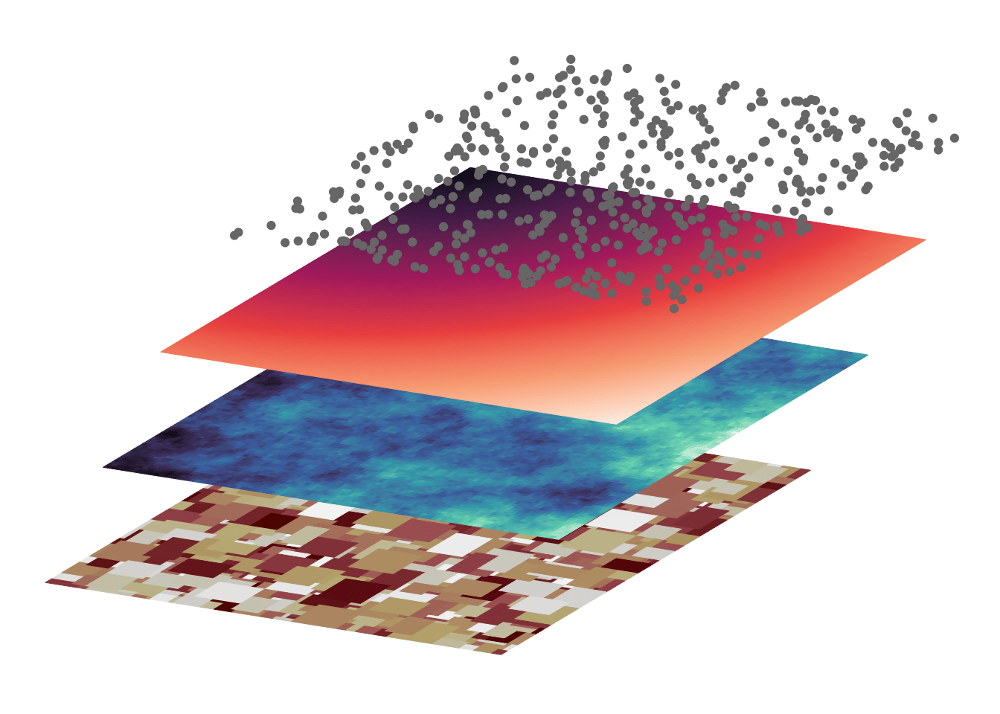

<!-- README.md is generated from README.Rmd. Please edit that file -->

# layer

<!-- badges: start -->
<!-- badges: end -->

The goal of layer is to …

## Installation

You can install the development version of layer from
[GitHub](https://github.com/) with:

``` r
# install.packages("devtools")
devtools::install_github("marcosci/layer")
```

## Example

This is a basic example which shows you how to solve a common problem:

``` r
library(layer)

tilt_landscape_1 <- tilt_map(landscape_1)
#> Loading required package: raster
#> Loading required package: sp
tilt_landscape_2 <- tilt_map(landscape_2, x_shift = 50, y_shift = 50)
tilt_landscape_3 <- tilt_map(landscape_3, x_shift = 100, y_shift = 100)
tilt_landscape_points <- tilt_map(landscape_points, x_shift = 150, y_shift = 150)

map_list <- list(tilt_landscape_1, tilt_landscape_2, tilt_landscape_3, tilt_landscape_points)

plot_tiltedmaps(map_list, 
                c("layer", "layer", "layer", NA), 
                palette = c("bilbao", "mako", "rocket", NA),
                color = "grey40")
#> Scale for 'fill' is already present. Adding another scale for 'fill', which
#> will replace the existing scale.
#> Warning in viridisLite::viridis(n, alpha, begin, end, direction, option): Option
#> 'NA' does not exist. Defaulting to 'viridis'.
#> Scale for 'colour' is already present. Adding another scale for 'colour',
#> which will replace the existing scale.
#> Warning in viridisLite::viridis(n, alpha, begin, end, direction, option): Option
#> 'NA' does not exist. Defaulting to 'viridis'.
```


