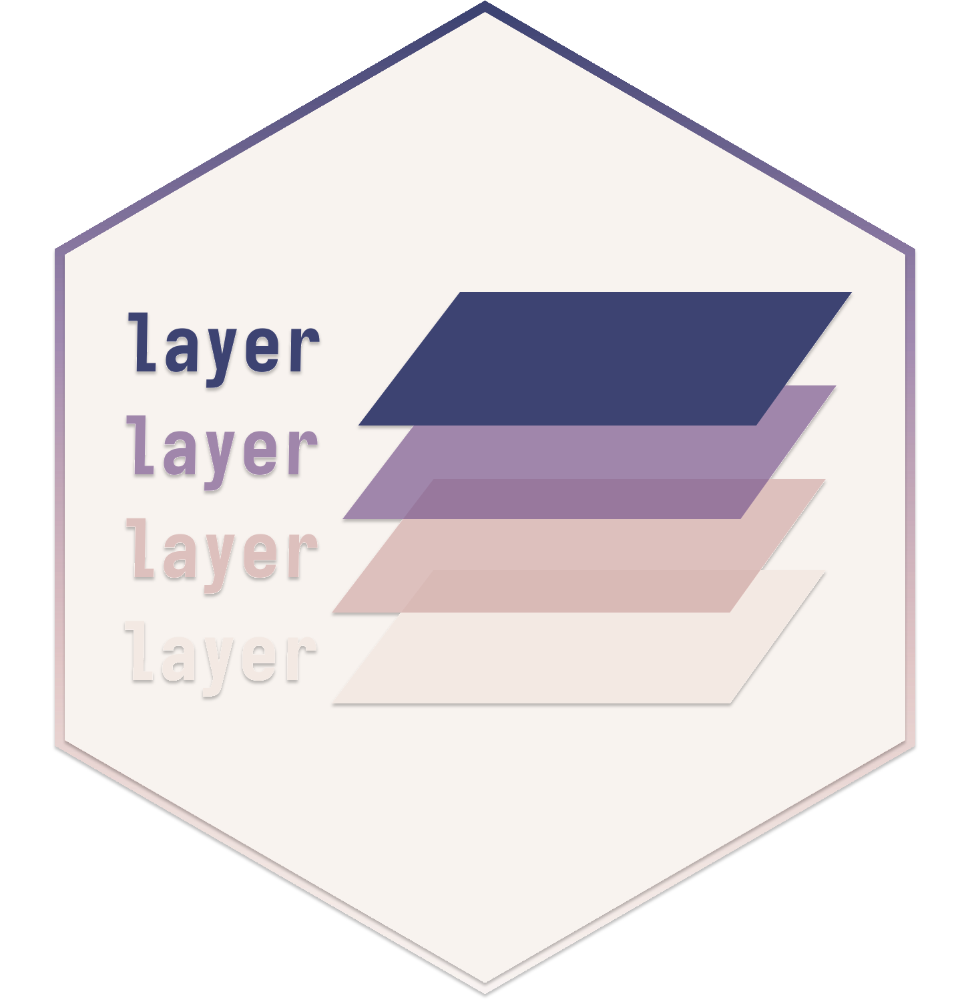
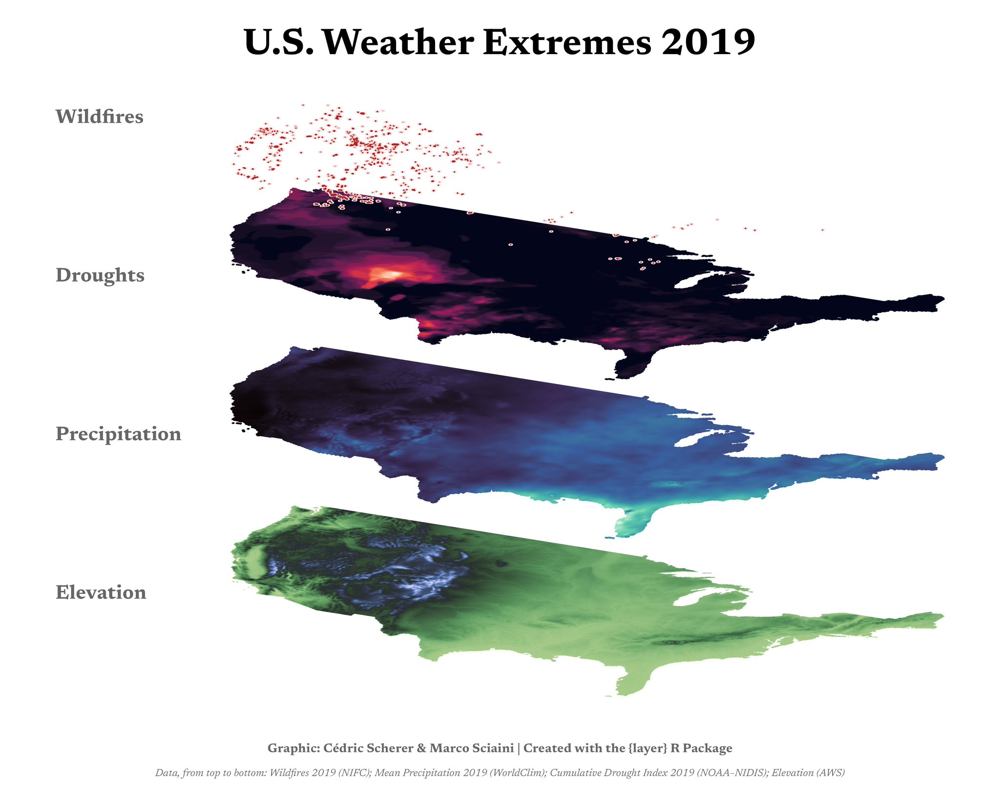
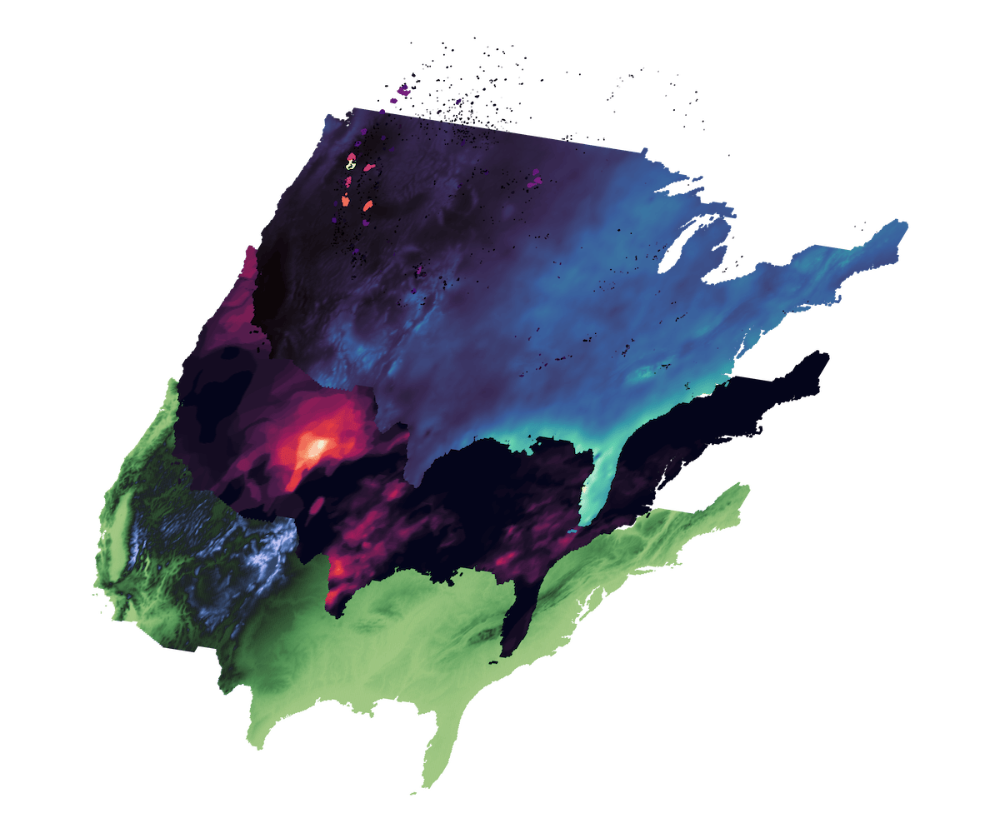

<!-- README.md is generated from README.qmd. Please edit that file -->

```{r opts, echo = FALSE}
knitr::opts_chunk$set(
  collapse = TRUE,
  warning = TRUE,
  message = FALSE,
  width = 120,
  comment = "#>",
  fig.retina = 2,
  fig.path = "man/figures/README-"
)
```


# layer <a></a>

<!-- badges: start -->

[](https://www.repostatus.org/#active)
[](https://lifecycle.r-lib.org/articles/stages.html#stable){target="_blank"} [](https://CRAN.R-project.org/package=layer){target="_blank"}
[](https://CRAN.R-project.org/package=layer){target="_blank"}
[](https://CRAN.R-project.org/package=layer){target="_blank"}
[](https://github.com/marcosci/layer/actions/workflows/R-CMD-check.yaml)

[](https://doi.org/10.32614/CRAN.package.layer)

<!-- badges: end -->

The goal of `layer` is to simplify the whole process of creating stacked tilted maps, that are often used in scientific publications to show different environmental
layers for a geographical region. Tilting maps and layering them allows to easily draw visual correlations between these environmental layers.

Something in the line of:

```{r, echo = FALSE, fig.alt = "Example of a stacked tilted map by Cédric Scherer and Marco Sciaini"}

```

## Installation

You can install the development version of layer from [GitHub](https://github.com/) with:

```{r, eval = FALSE}
# install.packages("remotes")
remotes::install_github("marcosci/layer")
```

## Example

This is a basic example which shows you how to solve a common problem:

```{r example, fig.alt = "Basic example of a stacked tilted map"}
library(layer)

tilt_stack(x_shift_step = 25, y_shift_step = 50) |>
  tilt_layer(landscape_1, palette = "bilbao") |>
  tilt_layer(landscape_2, palette = "mako") |>
  tilt_layer(landscape_3, palette = "rocket") |>
  tilt_connector(landscape_points, color = "grey40")
```

### More advanced example

Some more realistic looking data (DEM, drought, precipitation, and wildfires for continental USA): 

```{r adv-example, eval = !file.exists("man/figures/README-adv-example.png"), fig.alt = "Advanced example of a stacked tilted map"}
tilt_stack(y_tilt = 3, x_shift_step = 15, y_shift_step = 25) |>
  tilt_layer(dem_usa, palette = "tofino", direction = -1) |>
  tilt_layer(drought_usa, palette = "rocket") |>
  tilt_layer(prec_usa, palette = "mako") |>
  tilt_layer(fire_usa, palette = "magma")
```

```{r, echo = FALSE, fig.alt = "Advanced example of a stacked tilted map"}

```

## Code of Conduct

Please note that the `layer` project is released with a [Contributor Code of Conduct](https://contributor-covenant.org/version/2/0/CODE_OF_CONDUCT.html).
By contributing to this project, you agree to abide by its terms.
