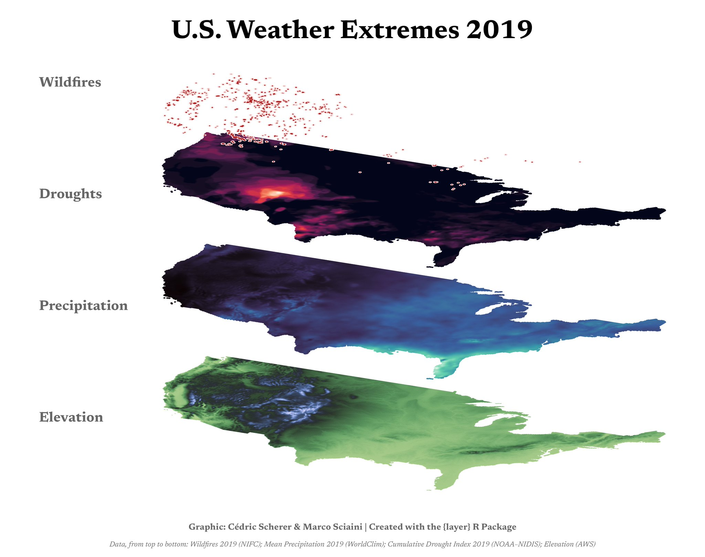
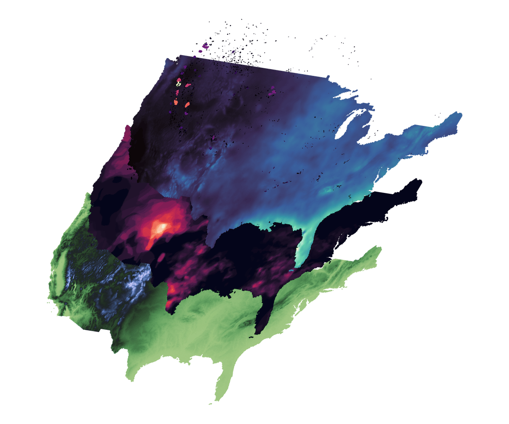

# layer

The goal of `layer` is to simplify the whole process of creating stacked
tilted maps, that are often used in scientific publications to show
different environmental layers for a geographical region. Tilting maps
and layering them allows to easily draw visual correlations between
these environmental layers.

Something in the line of:



## Installation

You can install the development version of layer from
[GitHub](https://github.com/) with:

``` r
# install.packages("remotes")
remotes::install_github("marcosci/layer")
```

## Example

This is a basic example which shows you how to solve a common problem:

``` r
library(layer)

tilt_landscape_1 <- tilt_map(landscape_1)
tilt_landscape_2 <- tilt_map(landscape_2, x_shift = 25, y_shift = 50)
tilt_landscape_3 <- tilt_map(landscape_3, x_shift = 50, y_shift = 100)
tilt_landscape_points <- tilt_map(landscape_points, x_shift = 75, y_shift = 150)

map_list <- list(tilt_landscape_1, tilt_landscape_2, tilt_landscape_3, tilt_landscape_points)

plot_tiltedmaps(map_list,
                layer = c("value", "value", "value", NA),
                palette = c("bilbao", "mako", "rocket", NA),
                color = "grey40")
```


### More advanced example

Some more realistic looking data (DEM, drought, precipitation, and
wildfires for continental USA):

``` r
tilt_landscape_1 <- tilt_map(dem_usa, y_tilt = 3)
tilt_landscape_2 <- tilt_map(drought_usa, y_tilt = 3, x_shift = 15, y_shift = 25)
tilt_landscape_3 <- tilt_map(prec_usa, y_tilt = 3, x_shift = 30, y_shift = 50)
tilt_landscape_4 <- tilt_map(fire_usa, y_tilt = 3, x_shift = 45, y_shift = 65)

map_list <- list(tilt_landscape_1, tilt_landscape_2, tilt_landscape_3, tilt_landscape_4)

plot_tiltedmaps(map_list, palette = c("tofino", "rocket", "mako", "magma"), direction = c(-1, 1, 1, 1))
```



## Code of Conduct

Please note that the `layer` project is released with a [Contributor
Code of
Conduct](https://contributor-covenant.org/version/2/0/CODE_OF_CONDUCT.html).
By contributing to this project, you agree to abide by its terms.
